# Visual Studio Code Quick Start

## examples

* VS Code + draw.io

* [Linux C example code](examples/linux-c)
* [Linux kenrel debugging](https://github.com/mengning/linuxkernel/tree/master/src/kerneldebuging)
